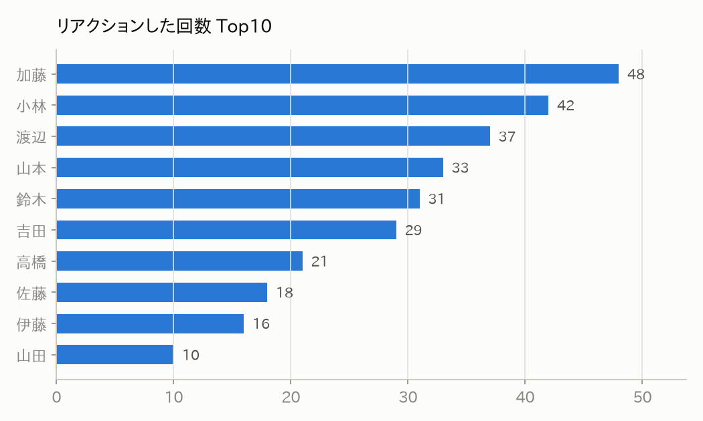
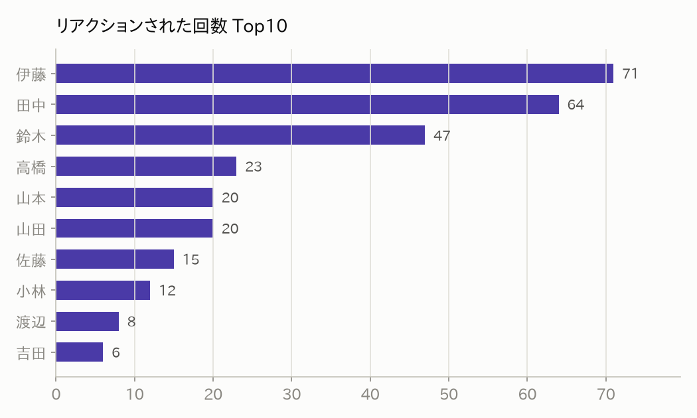
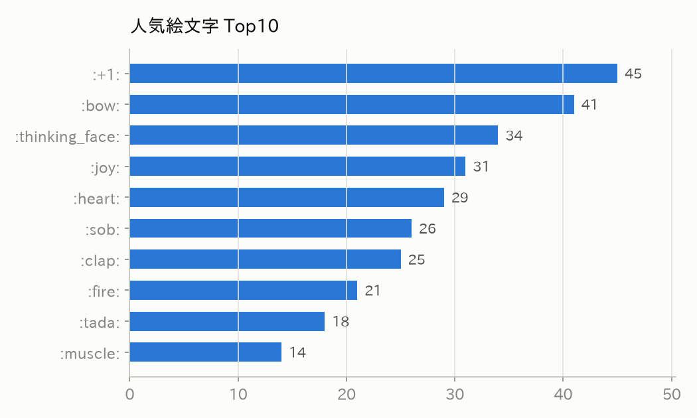
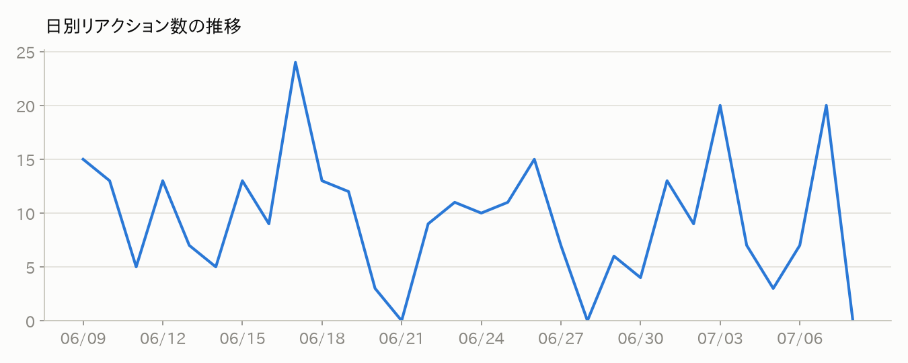
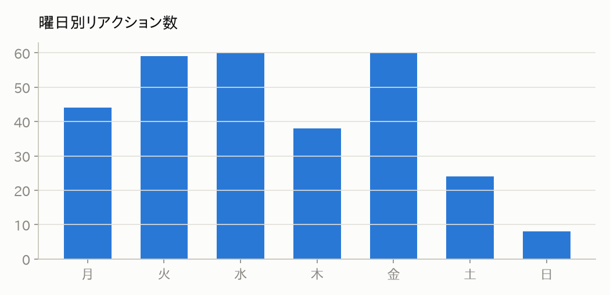
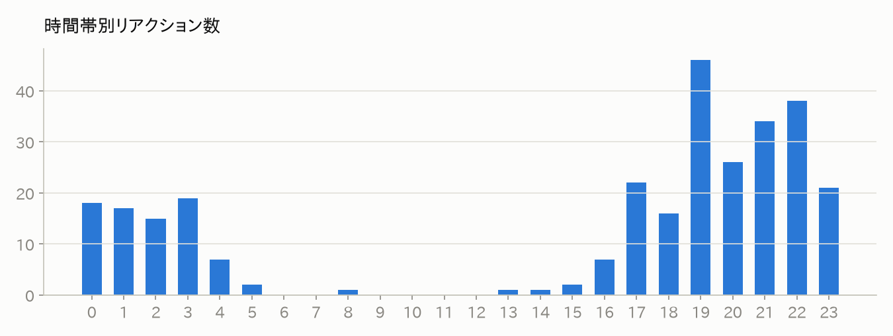
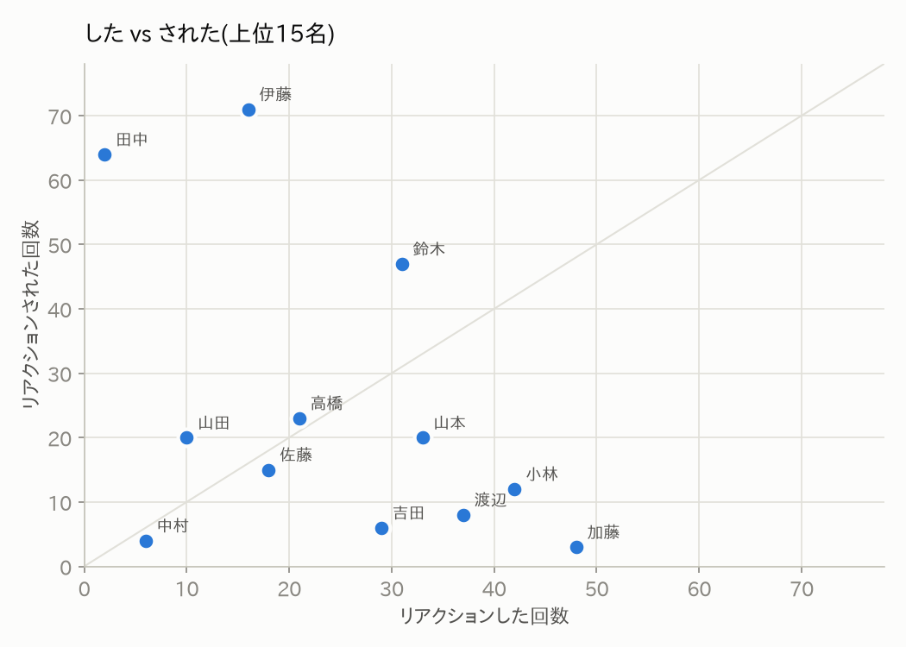
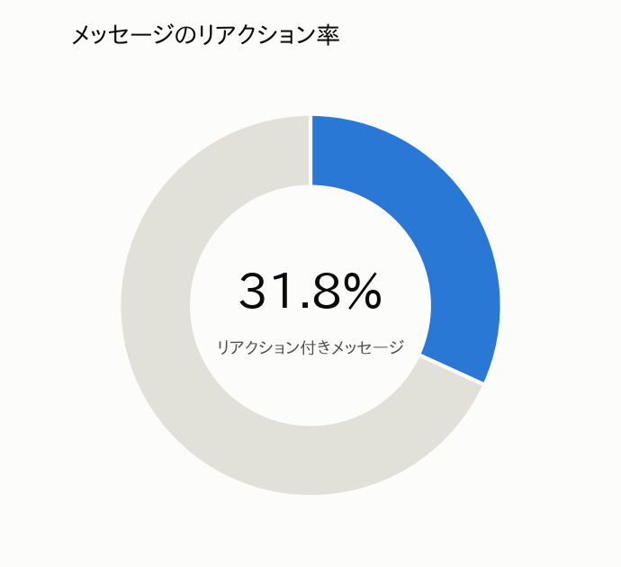

# Slackリアクション分析 #demo-channel

**期間**: 2026-06-09 〜 2026-07-08(30日間) / **生成**: 2026-07-07T14:27

## サマリー

| 指標 | 値 |
|---|---|
| 総メッセージ数 | 525 |
| 総リアクション数 | 293 |
| リアクション率 | 31.8% |
| 平均リアクション/投稿 | 0.56 |
| リアクションした人数 | 12 |
| 絵文字の種類 | 12 |

## ① リアクションした回数ランキング

| 順位 | ユーザー | 回数 |
|---|---|---|
| 1 | 加藤 | 48 |
| 2 | 小林 | 42 |
| 3 | 渡辺 | 37 |
| 4 | 山本 | 33 |
| 5 | 鈴木 | 31 |
| 6 | 吉田 | 29 |
| 7 | 高橋 | 21 |
| 8 | 佐藤 | 18 |
| 9 | 伊藤 | 16 |
| 10 | 山田 | 10 |

## ② リアクションされた回数ランキング

| 順位 | ユーザー | 回数 |
|---|---|---|
| 1 | 伊藤 | 71 |
| 2 | 田中 | 64 |
| 3 | 鈴木 | 47 |
| 4 | 高橋 | 23 |
| 5 | 山本 | 20 |
| 6 | 山田 | 20 |
| 7 | 佐藤 | 15 |
| 8 | 小林 | 12 |
| 9 | 渡辺 | 8 |
| 10 | 吉田 | 6 |

## ③ 人気絵文字 Top10

## ④ 日別リアクション数の推移

## ⑤ 曜日別 / ⑥ 時間帯別

## ⑦ した vs された

## ⑧ メッセージのリアクション率

---

> 日別/曜日別/時間帯別はメッセージ投稿日時ベースの集計です(Slack APIはリアクション時刻を返さないため)。
